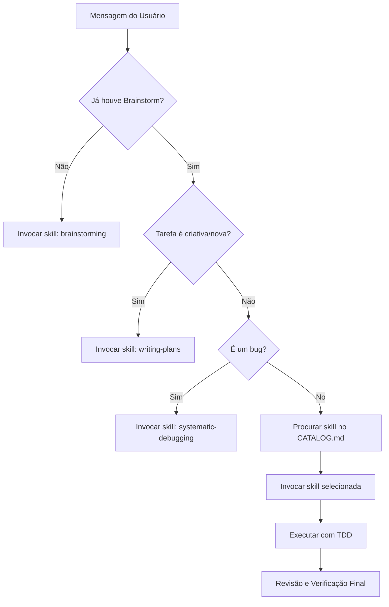

# 🪄 Using Superpowers (The Maestro)

Esta skill estabelece o **Sistema Operacional** de trabalho. Ela garante que você opere como um engenheiro disciplinado, não apenas um digitador de código.

<EXTREMELY-IMPORTANT>
Se houver 1% de chance de uma skill se aplicar ao que você está fazendo, você DEVE invocá-la.
INVOCAR A SKILL RELEVANTE ANTES DE QUALQUER AÇÃO NÃO É OPCIONAL.
</EXTREMELY-IMPORTANT>

## 🛡️ Hierarquia de Instruções
1. **Instruções Explícitas do Usuário** (`CORE.md`, `GEMINI.md`, `AGENTS.md`) — Prioridade Máxima.
2. **Skills Superpowers** — Sobrescrevem o comportamento padrão do sistema.
3. **Prompt Padrão do Sistema** — Prioridade Mínima.

## 🔄 Fluxo de Trabalho (The Loop)
Sempre que uma nova tarefa for recebida, siga este fluxo mental:

## 🚩 Red Flags (Pare se pensar isso)
| Pensamento | Realidade |
| :--- | :--- |
| "É só uma pergunta simples." | Perguntas são tarefas. Verifique se há skills. |
| "Vou explorar o código primeiro." | Skills dizem COMO explorar com segurança. |
| "Isso não precisa de plano formal." | Tudo precisa de design. Omitir plano gera dívida técnica. |
| "Eu já conheço essa skill." | Skills evoluem. Leia a versão atual no workspace. |

## 🛠️ Regra de Ouro: Skill-Check
**Invoque skills relevantes ANTES de qualquer resposta ou ação.** Mesmo que você precise apenas fazer uma pergunta de esclarecimento, verifique se a skill de `brainstorming` tem diretrizes sobre como perguntar (ex: uma pergunta por vez).

---
*Parte do ecossistema Antigravity — Disciplina é Liberdade.*